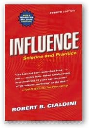

After my [introductory notes](/blog/influence_why_a.html), I’ve received a few inquires about more notes on Cialdini’s [Influence Science and Practice](https://www.amazon.com/gp/product/0321011473/&tag=notesfromatoo-20). So I dug around on the web and offer up my discoveries.

The best of the bunch (much like my own) is a series in six parts starting on [Janin’s (sp?) blog happening-here](https://happening-here.blogspot.com/2006/01/surrounded-by-weapons-of-influence.html). _Update: Just discovered Marshall Soules class Media studies 205: Promotion, Persuasion and Propaganda. Fall 2006. (at Malaspina University College, Nanaimo BC). Marshall’s course also has an extensive summary._

Other pages of interest:

*   Scott Foresman’s one page summary: https://pages.prodigy.net/mschnall/cialdini.html
*   Some good notes from the [Mind Hack’s blog](https://www.mindhacks.com/blog/2006/02/influence_by_robert.html)
*   An extended review courtesy of PronettSolutions
*   Another extended review by [Jack Thomas](https://jackthomas.livejournal.com/104831.html)
*   Back issues of the influence report – a monthly report put out Robert’s company that contain new snippets.
*   Robert Cialdini’s company offers seminars
*   Finally the inevitable [Wikipedia entry](https://en.wikipedia.org/wiki/Influence_Science_and_Practice) Influence Science Practice